# オブジェクトのデータ構造を示す図をGraphvizで描こうとしたがrankとrankdirがわからず試行錯誤した話

[back to the project repository](https://github.com/kazurayam/GraphvizMythOfRankAndRankdir)

## 解決すべき問題

Javaオブジェクトをの内部のデータ構造を表現する画像を生成したいと思った。

たとえばこういう画像を生成したい。

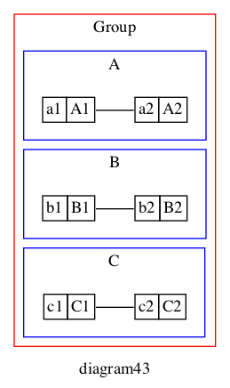

## 001

    digraph G {
        graph [ label="diagram001" ];
        A1 -> A2;
    }

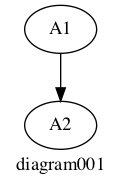

## 002

    digraph G {
        graph [
            label="diagram002",
            rankdir=TB
        ];
        A1 -> A2;
    }

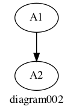

## 003

    digraph G {
        graph [
            label="diagram003",
            rankdir=LR
        ];
        A1 -> A2;
    }

## 012

    digraph G {
        graph [
            label="diagram012",
            rankdir=TB
        ];
        A1 -> A2;
        B1 -> B2;
    }

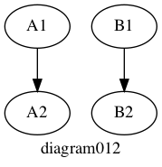

## 013

    digraph G {
        graph [
            label="diagram013",
            rankdir=LR
        ];
        A1 -> A2;
        B1 -> B2;
    }

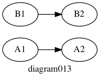

## 020

    digraph G {
        graph [
            label="diagram020",
            rankdir=TB
        ];
        A1 -> B1; B1 -> C1;
        A2 -> B2; B2 -> C2;
    }

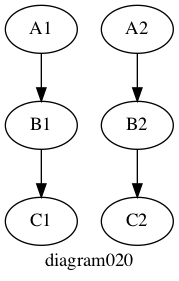

## 021

    digraph G {
        graph [
            label="diagram021",
            rankdir=TB
        ];
        A1 -> B1; B1 -> C1;
        A2 -> B2; B2 -> C2;
        A1 -> A2;
    }

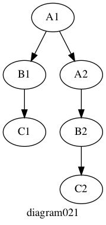

## 022

    digraph G {
        graph [
            label="diagram022",
            rankdir=TB
        ];
        A1 -> B1; B1 -> C1;
        A2 -> B2; B2 -> C2;
        A1 -> A2;
        {rankdir=LR; rank=same; A1, A2;}
    }

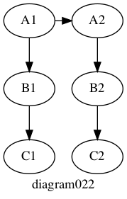

## 023

    digraph G {
        graph [
            label="diagram023",
            rankdir=TB
        ];
        A1 -> B1; B1 -> C1;
        A2 -> B2; B2 -> C2;
        A1 -> A2;
        B1 -> B2;
        C1 -> C2;
        {rankdir=LR; rank=same; A1, A2;}   
    }

## 024

    digraph G {
        graph [
            label="diagram024",
            rankdir=TB
        ];
        A1 -> B1; B1 -> C1;
        A2 -> B2; B2 -> C2;
        A1 -> A2;
        B1 -> B2;
        C1 -> C2;
        {rankdir=LR; rank=same; A1, A2;}
        {rankdir=LR; rank=same; B1, B2;}
        {rankdir=LR; rank=same; C1, C2;}
    }

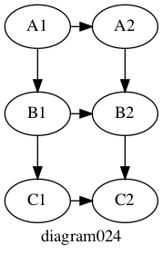

## 030

    digraph G {
        graph [
            rankdir=TB
        ];
        A1 [shape=record];
        A2 [shape=record];
        A1 -> B1;
        B1 -> C1;
        A2 -> B2;
        B2 -> C2;
        A1 -> A2;
        B1 -> B2;
        C1 -> C2;
        {rankdir=LR; rank=same; A1, A2;}
        {rankdir=LR; rank=same; B1, B2;}
        {rankdir=LR; rank=same; C1, C2;}
    }

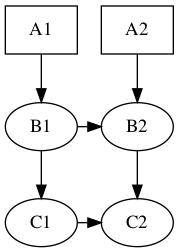

## 031

    digraph G {
        graph [
            label="diagram031",
            rankdir=TB
        ];
        node [
            shape=plaintext
        ]
        A1 [label=<<TABLE><TR><TD>a1</TD><TD>A1</TD></TR></TABLE>>];
        A2 [label=<<TABLE><TR><TD>a2</TD><TD>A2</TD></TR></TABLE>>];
        A1 -> B1;
        B1 -> C1;
        A2 -> B2;
        B2 -> C2;
        A1 -> A2;
        B1 -> B2;
        C1 -> C2;
        {rankdir=LR; rank=same; A1, A2;}
        {rankdir=LR; rank=same; B1, B2;}
        {rankdir=LR; rank=same; C1, C2;}
    }

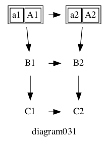

## 032

    digraph G {
        graph [
            label="diagram032",
            rankdir=TB
        ];
        node [
            shape=plaintext
        ]
        A1 [label=<<TABLE BORDER="0" CELLBORDER="1" CELLSPACING="0"><TR><TD>a1</TD><TD>A1</TD></TR></TABLE>>];
        A2 [label=<<TABLE BORDER="0" CELLBORDER="1" CELLSPACING="0"><TR><TD>a2</TD><TD>A2</TD></TR></TABLE>>];
        A1 -> B1;
        B1 -> C1;
        A2 -> B2;
        B2 -> C2;
        A1 -> A2;
        B1 -> B2;
        C1 -> C2;
        {rankdir=LR; rank=same; A1, A2;}
        {rankdir=LR; rank=same; B1, B2;}
        {rankdir=LR; rank=same; C1, C2;}
    }

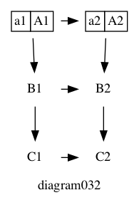

## 033

    digraph G {
        graph [
            label="diagram033",
            rankdir=TB
        ];
        node [
            shape=plaintext
        ]
        A1 [label=<<TABLE BORDER="0" CELLBORDER="1" CELLSPACING="0"><TR>
            <TD PORT="f0">a1</TD><TD PORT="f1">A1</TD>
            </TR></TABLE>>];
        A2 [label=<<TABLE BORDER="0" CELLBORDER="1" CELLSPACING="0"><TR>
            <TD PORT="f0">a2</TD><TD PORT="f1">A2</TD>
            </TR></TABLE>>];
        A1:f0 -> B1;
        B1 -> C1;
        A2 -> B2;
        B2 -> C2;
        A1:f1 -> A2:f0 [arrowhead=none];
        B1 -> B2;
        C1 -> C2;
        {rankdir=LR; rank=same; A1, A2;}
        {rankdir=LR; rank=same; B1, B2;}
        {rankdir=LR; rank=same; C1, C2;}
    }

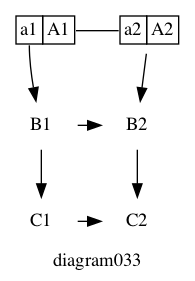

## 034

    digraph G {
        graph [
            rankdir=TB,
            label="diagram34"
        ];
        node [
            shape=plaintext
        ]
        A1 [label=<<TABLE BORDER="0" CELLBORDER="1" CELLSPACING="0"><TR>
            <TD PORT="f0">a1</TD><TD PORT="f1">A1</TD>
                </TR></TABLE>>];
        A2 [label=<<TABLE BORDER="0" CELLBORDER="1" CELLSPACING="0"><TR>
                <TD PORT="f0">a2</TD><TD PORT="f1">A2</TD>
                </TR></TABLE>>];
        B1 [label=<<TABLE BORDER="0" CELLBORDER="1" CELLSPACING="0"><TR>
                <TD PORT="f0">b1</TD><TD PORT="f1">B1</TD>
                </TR></TABLE>>];
        B2 [label=<<TABLE BORDER="0" CELLBORDER="1" CELLSPACING="0"><TR>
            <TD PORT="f0">b2</TD><TD PORT="f1">B2</TD>
            </TR></TABLE>>];
        C1 [label=<<TABLE BORDER="0" CELLBORDER="1" CELLSPACING="0"><TR>
            <TD PORT="f0">c1</TD><TD PORT="f1">C1</TD>
            </TR></TABLE>>];
        C2 [label=<<TABLE BORDER="0" CELLBORDER="1" CELLSPACING="0"><TR>
            <TD PORT="f0">c2</TD><TD PORT="f1">C2</TD>
            </TR></TABLE>>];
        //
        A1:f1 -> B1:f1;
        B1:f1 -> C1:f1;
        A2:f0 -> B2:f0;
        B2:f0 -> C2:f0;
        //
        A1:f1 -> A2:f0 [arrowhead=none];
        B1:f1 -> B2:f0 [arrowhead=none];
        C1:f1 -> C2:f0 [arrowhead=none];
        {rankdir=LR; rank=same; A1, A2;}
        {rankdir=LR; rank=same; B1, B2;}
        {rankdir=LR; rank=same; C1, C2;}
    }

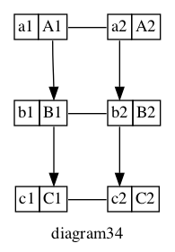

## 041

    digraph G {
        graph [
            rankdir=TB,
            label="diagram41"
        ];
        node [
            shape=plaintext
        ]
        subgraph cluster_A {
          graph [
            label="A"
          ];
          A1 [label=<<TABLE BORDER="0" CELLBORDER="1" CELLSPACING="0"><TR>
            <TD PORT="f0">a1</TD><TD PORT="f1">A1</TD>
                </TR></TABLE>>];
          A2 [label=<<TABLE BORDER="0" CELLBORDER="1" CELLSPACING="0"><TR>
                <TD PORT="f0">a2</TD><TD PORT="f1">A2</TD>
                </TR></TABLE>>];
          A1:f1 -> A2:f0 [arrowhead=none];
          {rankdir=LR; rank=same; A1, A2;}
        }
        subgraph cluster_B {
          graph [
            label="B"
          ];
          B1 [label=<<TABLE BORDER="0" CELLBORDER="1" CELLSPACING="0"><TR>
                <TD PORT="f0">b1</TD><TD PORT="f1">B1</TD>
                </TR></TABLE>>];
          B2 [label=<<TABLE BORDER="0" CELLBORDER="1" CELLSPACING="0"><TR>
            <TD PORT="f0">b2</TD><TD PORT="f1">B2</TD>
            </TR></TABLE>>];
          B1:f1 -> B2:f0 [arrowhead=none];
          {rankdir=LR; rank=same; B1, B2;}
        }
        subgraph cluster_C {
          graph [
            label="C"
          ];
          C1 [label=<<TABLE BORDER="0" CELLBORDER="1" CELLSPACING="0"><TR>
            <TD PORT="f0">c1</TD><TD PORT="f1">C1</TD>
            </TR></TABLE>>];
          C2 [label=<<TABLE BORDER="0" CELLBORDER="1" CELLSPACING="0"><TR>
            <TD PORT="f0">c2</TD><TD PORT="f1">C2</TD>
            </TR></TABLE>>];
          C1:f1 -> C2:f0 [arrowhead=none];
          {rankdir=LR; rank=same; C1, C2;}
        }
        //
        A1:f1 -> B1:f1;
        B1:f1 -> C1:f1;
        A2:f0 -> B2:f0;
        B2:f0 -> C2:f0;
    }

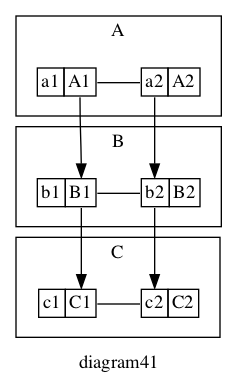

## 024

    digraph G {
        graph [
            rankdir=TB,
            label="diagram42"
        ];
        node [
            shape=plaintext
        ]
        subgraph cluster_Group {
          graph [
            label="Group",
            color="red"
          ]
          //
          subgraph cluster_A {
            graph [
              label="A",
              color="blue"
            ];
            A1 [label=<<TABLE BORDER="0" CELLBORDER="1" CELLSPACING="0"><TR>
                  <TD PORT="f0">a1</TD><TD PORT="f1">A1</TD>
                </TR></TABLE>>];
            A2 [label=<<TABLE BORDER="0" CELLBORDER="1" CELLSPACING="0"><TR>
                  <TD PORT="f0">a2</TD><TD PORT="f1">A2</TD>
                </TR></TABLE>>];
            A1:f1 -> A2:f0 [arrowhead=none];
            {rankdir=LR; rank=same; A1, A2;}
          }
          //
          subgraph cluster_B {
            graph [
              label="B",
              color="blue"
            ];
            B1 [label=<<TABLE BORDER="0" CELLBORDER="1" CELLSPACING="0"><TR>
                  <TD PORT="f0">b1</TD><TD PORT="f1">B1</TD>
                </TR></TABLE>>];
            B2 [label=<<TABLE BORDER="0" CELLBORDER="1" CELLSPACING="0"><TR>
                  <TD PORT="f0">b2</TD><TD PORT="f1">B2</TD>
                </TR></TABLE>>];
            B1:f1 -> B2:f0 [arrowhead=none];
            {rankdir=LR; rank=same; B1, B2;}
          }
          //
          subgraph cluster_C {
            graph [
              label="C",
              color="blue"
            ];
            C1 [label=<<TABLE BORDER="0" CELLBORDER="1" CELLSPACING="0"><TR>
                  <TD PORT="f0">c1</TD><TD PORT="f1">C1</TD>
                </TR></TABLE>>];
            C2 [label=<<TABLE BORDER="0" CELLBORDER="1" CELLSPACING="0"><TR>
                  <TD PORT="f0">c2</TD><TD PORT="f1">C2</TD>
                </TR></TABLE>>];
            C1:f1 -> C2:f0 [arrowhead=none];
            {rankdir=LR; rank=same; C1, C2;}
          }
          //
          A1:f1 -> B1:f1;
          B1:f1 -> C1:f1;
          A2:f0 -> B2:f0;
          B2:f0 -> C2:f0;
        }
    }

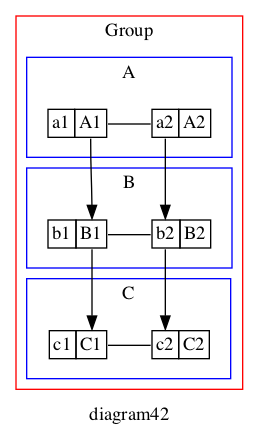

## 024

    digraph G {
        graph [
            rankdir=TB,
            label="diagram43"
        ];
        node [
            shape=plaintext
        ]
        subgraph cluster_Group {
          graph [
            label="Group",
            color="red"
          ]
          //
          subgraph cluster_A {
            graph [
              label="A",
              color="blue"
            ];
            A1 [label=<<TABLE BORDER="0" CELLBORDER="1" CELLSPACING="0"><TR>
                  <TD PORT="f0">a1</TD><TD PORT="f1">A1</TD>
                </TR></TABLE>>];
            A2 [label=<<TABLE BORDER="0" CELLBORDER="1" CELLSPACING="0"><TR>
                  <TD PORT="f0">a2</TD><TD PORT="f1">A2</TD>
                </TR></TABLE>>];
            A1:f1 -> A2:f0 [arrowhead=none];
            {rankdir=LR; rank=same; A1, A2;}
          }
          //
          subgraph cluster_B {
            graph [
              label="B",
              color="blue"
            ];
            B1 [label=<<TABLE BORDER="0" CELLBORDER="1" CELLSPACING="0"><TR>
                  <TD PORT="f0">b1</TD><TD PORT="f1">B1</TD>
                </TR></TABLE>>];
            B2 [label=<<TABLE BORDER="0" CELLBORDER="1" CELLSPACING="0"><TR>
                  <TD PORT="f0">b2</TD><TD PORT="f1">B2</TD>
                </TR></TABLE>>];
            B1:f1 -> B2:f0 [arrowhead=none];
            {rankdir=LR; rank=same; B1, B2;}
          }
          //
          subgraph cluster_C {
            graph [
              label="C",
              color="blue"
            ];
            C1 [label=<<TABLE BORDER="0" CELLBORDER="1" CELLSPACING="0"><TR>
                  <TD PORT="f0">c1</TD><TD PORT="f1">C1</TD>
                </TR></TABLE>>];
            C2 [label=<<TABLE BORDER="0" CELLBORDER="1" CELLSPACING="0"><TR>
                  <TD PORT="f0">c2</TD><TD PORT="f1">C2</TD>
                </TR></TABLE>>];
            C1:f1 -> C2:f0 [arrowhead=none];
            {rankdir=LR; rank=same; C1, C2;}
          }
          //
          A1:f1 -> B1:f1 [style="invis"];
          B1:f1 -> C1:f1 [style="invis"];
          A2:f0 -> B2:f0 [style="invis"];
          B2:f0 -> C2:f0 [style="invis"];
        }
    }

